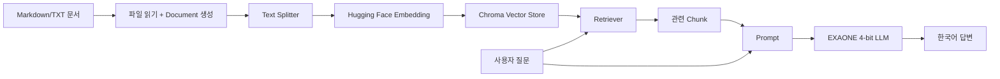

# Step 15. [보충실습] Korean RAG Pipeline with LangChain + Hugging Face

교재: [15. Korean RAG Pipeline with LangChain + Hugging Face](https://app.notion.com/p/3e591bd5a9ac81468a92d49eccd25726)

이 장은 00~14장 누적 프로젝트와 별도로 **Google Colab에서 실행하는 선택형 보충실습**입니다.

- Notebook: `korean_rag_colab.ipynb`
- 테스트 문서: `sample_data.md`
- Colab에서 Notebook을 연 뒤 GPU 런타임으로 변경해 순서대로 실행합니다.

[Google Colab에서 열기](https://colab.research.google.com/github/comstudynews/rag-pipeline-lab2026/blob/main/step15_huggingface_colab/korean_rag_colab.ipynb)

---

## 실습 개요
**목표**
Google Colab에서 Hugging Face **Embedding 모델 + 한국어 LLM + Chroma Vector Store**로 Korean RAG Pipeline을 구성합니다. 모델은 처음 실행할 때 Hugging Face Hub에서 다운로드합니다.
**문서 업로드 → Chunking → Embedding → Vector Store → Retriever → LLM → Retrieval Chain** 순서로 진행합니다.
<table fit-page-width="true" header-row="true">
<colgroup>
<col width="137">
<col width="535">
</colgroup>
<tr>
<td>구분</td>
<td>실습 설정</td>
</tr>
<tr>
<td>실행 환경</td>
<td>Google Colab, NVIDIA GPU 권장</td>
</tr>
<tr>
<td>권장 GPU</td>
<td>A100 권장, L4/T4는 모델 크기와 양자화 설정에 따라 가능</td>
</tr>
<tr>
<td>Embedding</td>
<td>intfloat/multilingual-e5-large-instruct</td>
</tr>
<tr>
<td>LLM</td>
<td>LGAI-EXAONE/EXAONE-3.0-7.8B-Instruct</td>
</tr>
<tr>
<td>Vector Store</td>
<td>Chroma Local</td>
</tr>
<tr>
<td>Framework</td>
<td>LangChain + langchain-huggingface</td>
</tr>
<tr>
<td>양자화</td>
<td>bitsandbytes 4-bit NF4</td>
</tr>
</table>
**Colab 주의사항**
7\~8B급 모델은 GPU 메모리를 많이 사용합니다. 기본 구성은 **4-bit 양자화 LLM + CPU Embedding**이며, A100을 권장합니다. L4/T4도 모델 크기와 설정에 따라 사용할 수 있습니다.
---
## 1. Colab 런타임을 GPU로 설정하기
① Colab 메뉴에서 **런타임 → 런타임 유형 변경**을 선택합니다.
② 하드웨어 가속기를 GPU로 지정합니다.
③ 가능하면 A100을 선택하고 저장합니다.
아래 셀로 GPU 상태를 확인합니다.
```python
!nvidia-smi
```
```python
import torch

print("PyTorch:", torch.__version__)
print("CUDA available:", torch.cuda.is_available())
print("GPU:", torch.cuda.get_device_name(0) if torch.cuda.is_available() else "CPU")
```
정상 예시:
```plain text
CUDA available: True
GPU: NVIDIA A100-SXM4-40GB
```
---
## 2. 필요한 패키지 설치
수업 중 패키지 업데이트로 코드가 갑자기 깨지는 일을 줄이기 위해 **검증 기준 버전을 고정**합니다. Colab에 기본 설치된 PyTorch는 다시 설치하지 않습니다.
```python
!pip install -q \
  "langchain-classic==1.0.8" \
  "langchain-huggingface[full]==1.2.2" \
  "langchain-chroma==1.1.0" \
  "langchain-text-splitters==1.1.2" \
  "transformers==5.17.0" \
  "sentence-transformers==6.1.0" \
  "accelerate==1.14.0" \
  "bitsandbytes==0.50.2" \
  "chromadb==1.5.9"
```
설치가 끝나면 의존성 충돌을 먼저 확인합니다.
```python
!pip check
```
`No broken requirements found.`가 나오면 정상입니다.
패키지 설치 후 **런타임 → 세션 다시 시작**을 실행하고 1번 셀부터 다시 진행합니다.
재시작 후 주요 버전을 확인합니다.
```python
import importlib.metadata as md
import torch
import transformers

for pkg in [
    "langchain-classic",
    "langchain-huggingface",
    "langchain-chroma",
    "langchain-text-splitters",
    "sentence-transformers",
    "accelerate",
    "bitsandbytes",
    "chromadb",
]:
    print(f"{pkg:28s}: {md.version(pkg)}")

print(f"{'transformers':28s}: {transformers.__version__}")
print(f"{'torch':28s}: {torch.__version__}")
```
사용할 패키지의 import를 확인합니다.
```python
from langchain_core.documents import Document
from langchain_core.embeddings import Embeddings
from langchain_core.prompts import ChatPromptTemplate
from langchain_text_splitters import RecursiveCharacterTextSplitter
from langchain_huggingface import (
    HuggingFaceEmbeddings,
    HuggingFacePipeline,
    ChatHuggingFace,
)
from langchain_chroma import Chroma
from langchain_classic.chains import create_retrieval_chain
from langchain_classic.chains.combine_documents import create_stuff_documents_chain
from transformers import (
    AutoModelForCausalLM,
    AutoTokenizer,
    BitsAndBytesConfig,
    pipeline,
)

print("핵심 패키지 import 확인 완료")
```
**왜 langchain-huggingface를 별도로 설치하는가?**
Hugging Face 통합 기능은 `langchain_huggingface` 패키지에서 관리합니다. `HuggingFacePipeline`, `ChatHuggingFace`, `HuggingFaceEmbeddings`를 이 패키지에서 불러옵니다. 이번 실습은 `langchain-community`에 의존하지 않도록 구성했습니다.
---
## 3. Hugging Face 로그인
공개 모델은 토큰 없이 사용할 수 있는 경우도 있지만, 이번에 사용하는 EXAONE 저장소는 Hugging Face에서 **접근 조건 동의와 로그인**이 필요할 수 있으므로 먼저 인증합니다.
```python
from huggingface_hub import notebook_login

notebook_login()
```
① Hugging Face에 로그인합니다.
② `LGAI-EXAONE/EXAONE-3.0-7.8B-Instruct` 모델 페이지에서 접근 조건이 표시되면 먼저 동의합니다.
③ **Settings → Access Tokens**에서 Read 권한 토큰을 발급한 뒤 Colab 로그인 창에 입력합니다.
토큰을 소스코드에 직접 적지 않습니다. Colab의 로그인 UI 또는 Secrets 기능을 사용하는 편이 안전합니다.
---
## 4. 실습용 Markdown 문서 업로드
이번 실습에서는 전처리된 Markdown 파일을 하나 업로드하여 RAG 지식 문서로 사용합니다.
```python
from google.colab import files

uploaded = files.upload()
```
업로드된 파일명을 확인합니다.
```python
uploaded.keys()
```
첫 번째 업로드 파일을 자동으로 선택합니다.
```python
DATA_FILE = next(iter(uploaded.keys()))
print("사용 문서:", DATA_FILE)
```
---
## 5. 문서를 LangChain Document로 읽기
Main Path는 Markdown 또는 TXT 파일을 사용하며, Python 표준 라이브러리와 LangChain의 `Document` 객체로 읽습니다.
```python
from pathlib import Path
from langchain_core.documents import Document

text = Path(DATA_FILE).read_text(encoding="utf-8")
documents = [
    Document(
        page_content=text,
        metadata={"source": DATA_FILE},
    )
]

print("문서 개수:", len(documents))
print("source:", documents[0].metadata["source"])
print(documents[0].page_content[:500])
```
DOCX·PDF는 별도 Loader와 파서가 필요하므로 이 보충실습에서는 Markdown/TXT만 사용합니다.
---
## 6. Text Splitter로 Chunk 나누기
### 6.1 왜 문서를 나누는가
RAG에서는 긴 문서 전체를 한 번에 검색하지 않고, **검색하기 좋은 작은 조각**으로 나눈 뒤 관련 부분만 찾습니다.
Chunk는 검색을 위해 긴 문서를 나눈 작은 단위입니다.
```plain text
긴 문서
  ↓
Chunk 1
Chunk 2
Chunk 3
...
```
### 6.2 chunk_size와 chunk_overlap 이해하기
- `chunk_size=800`: 한 Chunk의 최대 크기를 약 800자로 설정합니다.
- `chunk_overlap=120`: 앞뒤 Chunk가 120자 정도 겹치게 하여 문맥이 경계에서 끊기는 문제를 줄입니다.
```plain text
Chunk 1: [--------------------]
                    [겹침]
Chunk 2:            [--------------------]
```
### 6.3 실제로 문서를 나누기
```python
from langchain_text_splitters import RecursiveCharacterTextSplitter

# 문서를 일정한 크기의 Chunk로 나누는 객체를 생성합니다.
text_splitter = RecursiveCharacterTextSplitter(
    chunk_size=800,     # 한 Chunk의 최대 크기
    chunk_overlap=120,  # 앞뒤 Chunk가 겹치는 구간
)

# LangChain Document 목록을 여러 Chunk로 분리합니다.
chunks = text_splitter.split_documents(documents)

print("Chunk 수:", len(chunks))
print("첫 Chunk 길이:", len(chunks[0].page_content))
print(chunks[0].page_content[:500])
```
### 6.4 앞쪽 Chunk를 직접 확인하기
```python
for i, chunk in enumerate(chunks[:3], 1):
    print(f"\n===== Chunk {i} =====")
    print(chunk.page_content[:400])
```
이번 실습은 `chunk_size=800`, `chunk_overlap=120`에서 시작하고 뒤에서 다른 값과 비교합니다.
---
## 7. Hugging Face Embedding 모델 로딩
### 7.1 Embedding이 무엇인가
Embedding은 문장을 **의미를 비교할 수 있는 숫자 벡터**로 바꾸는 과정입니다.
예를 들어 다음 두 문장은 표현은 다르지만 의미가 비슷합니다.
- "RAG는 외부 문서를 검색해 답변한다."
- "검색한 자료를 참고해서 LLM이 답한다."
Embedding 모델은 이런 문장을 숫자 좌표로 바꾸고, 의미가 비슷한 문장끼리 벡터 공간에서 가깝게 배치합니다.
### 7.2 기본 Embedding 객체 만들기
이번 실습에서는 `intfloat/multilingual-e5-large-instruct`를 사용합니다.
```python
from langchain_huggingface import HuggingFaceEmbeddings

# 사용할 Hugging Face Embedding 모델
EMBED_MODEL = "intfloat/multilingual-e5-large-instruct"

# Embedding 모델을 생성합니다.
# LLM에 GPU를 집중하기 위해 Embedding은 CPU에서 실행합니다.
base_embeddings = HuggingFaceEmbeddings(
    model_name=EMBED_MODEL,
    model_kwargs={"device": "cpu"},
    encode_kwargs={
        "normalize_embeddings": True,  # 벡터 유사도 비교가 안정적이도록 정규화
    },
)
```
### 7.3 문장 하나를 벡터로 바꿔 보기
```python
vector = base_embeddings.embed_query("RAG란 무엇인가?")
print("Embedding dimension:", len(vector))
print("앞쪽 5개 값:", vector[:5])
```
이 모델은 1024차원 벡터를 반환하므로 `Embedding dimension: 1024`가 나오면 정상입니다.
1024개 숫자의 개별 의미를 해석할 필요는 없습니다. 문장 하나가 1024차원 벡터로 표현된다는 점만 확인합니다.
### 7.4 E5 Instruct 모델이 질문을 처리하는 방식
E5 Instruct 계열은 질문(Query)에 **무엇을 검색하려는지 설명하는 instruction**을 붙이는 방식을 권장합니다.
사용자 질문:
```plain text
RAG란 무엇인가?
```
실제 Embedding 모델에 전달할 형태:
```plain text
Instruct: Retrieve relevant passages that answer the user's Korean question.
Query: RAG란 무엇인가?
```
저장할 문서 본문에는 이 instruction을 붙이지 않습니다.
### 7.5 Query에만 instruction을 붙이는 Wrapper 만들기
```python
from langchain_core.embeddings import Embeddings

class E5InstructEmbeddings(Embeddings):
    def __init__(self, base):
        # 실제 Embedding을 수행하는 객체를 보관합니다.
        self.base = base

    def embed_documents(self, texts):
        # Vector Store에 저장할 문서는 원문 그대로 Embedding합니다.
        return self.base.embed_documents(texts)

    def embed_query(self, text):
        # 검색 질문에는 검색 목적을 설명하는 instruction을 붙입니다.
        instruction = (
            "Instruct: Retrieve relevant passages that answer "
            "the user's Korean question.\nQuery: "
        )
        return self.base.embed_query(instruction + text)

# 이후 Vector Store와 Retriever에서는 이 객체를 사용합니다.
embeddings = E5InstructEmbeddings(base_embeddings)
```
**주해 — 왜 클래스를 하나 더 만드는가?**
LangChain은 문서를 저장할 때 `embed_documents()`, 질문을 검색할 때 `embed_query()`를 호출합니다. E5 모델의 특성에 맞춰 **문서는 그대로, 질문에는 instruction을 붙이기 위해** 중간 Wrapper를 만든 것입니다.
### 7.6 Wrapper 동작 확인
```python
vector = embeddings.embed_query("RAG란 무엇인가?")
print("Embedding dimension:", len(vector))
print(vector[:5])
```
---
## 8. Chroma Vector Store 구성
### 8.1 Vector Store는 무엇을 저장하는가
Vector Store는 보통 **원문 Chunk + Embedding Vector + metadata**를 함께 관리합니다.
```plain text
chunks
  ↓
Embedding 모델
  ↓
1024차원 Vector
  ↓
Chroma
  ↓
원문 + Vector + metadata 저장
```
**주해 — 벡터를 직접 계산해서 넣지 않아도 되는 이유**
`Chroma.from_documents()`에 `embedding=embeddings`를 넘기면 Chroma가 각 Document의 본문을 자동으로 Embedding하고, 생성된 벡터와 원문을 함께 저장합니다.
### 8.2 Chroma Vector Store 만들기
```python
from langchain_chroma import Chroma

vectorstore = Chroma.from_documents(
    documents=chunks,                  # 6장에서 만든 Chunk 목록
    embedding=embeddings,              # 7장에서 만든 Embedding 객체
    collection_name="korean_rag_demo", # Chroma 내부 컬렉션 이름
    persist_directory="./chroma_db",   # Colab 로컬 저장 위치
)

print("Vector Store 생성 완료")
```
### 8.3 저장 결과 확인
```python
print("저장한 Chunk 수:", len(chunks))
print("Vector Store 위치: ./chroma_db")
```
Colab 파일 영역에 `chroma_db` 폴더가 생성되면 정상입니다.
---
## 9. Retriever만 먼저 테스트하기
### 9.1 Retriever의 역할
Retriever는 Vector Store에서 **질문과 관련 있는 Chunk를 찾아오는 검색 담당자**입니다.
```plain text
사용자 질문
   ↓
질문 Embedding
   ↓
Vector Store와 유사도 비교
   ↓
관련 Chunk 반환
```
LLM을 연결하기 전에 검색 결과를 먼저 확인합니다.
### 9.2 가장 단순한 Retriever 만들기
```python
# Chroma Vector Store를 Retriever 인터페이스로 감쌉니다.
retriever = vectorstore.as_retriever()
```
### 9.3 질문을 넣어 검색해 보기
```python
question = "이 문서에서 가장 중요하게 설명하는 내용은 무엇인가?"

# invoke()에 질문을 전달하면 관련 Document 목록을 반환합니다.
retrieved_docs = retriever.invoke(question)
print("검색된 문서 수:", len(retrieved_docs))
```
### 9.4 검색 결과를 직접 확인하기
```python
for i, doc in enumerate(retrieved_docs, 1):
    print(f"\n===== 검색 결과 {i} =====")
    print(doc.page_content[:700])
```
먼저 Retriever가 질문과 관련된 Chunk를 찾았는지 확인합니다.
### 9.5 검색 개수 k 조정하기
```python
retriever = vectorstore.as_retriever(
    search_kwargs={
        "k": 3,  # 질문과 가장 가까운 Chunk를 최대 3개 가져옵니다.
    }
)
```
**주해 — k는 무엇인가?**
`k=3`은 질문과 가장 비슷한 Chunk를 최대 3개 반환하라는 뜻입니다. 너무 작으면 필요한 정보를 놓칠 수 있고, 너무 크면 관련 없는 내용까지 Prompt에 포함될 수 있습니다.
실제 RAG에서는 `k=3` 정도부터 시작한 뒤 1, 3, 5를 비교하면서 조정합니다.
---
## 10. 한국어 LLM 준비 — EXAONE
### 10.1 지금부터 무엇을 하는가
앞의 6\~9장에서는 **검색 파트**를 만들었습니다. 이제 검색된 문서를 읽고 최종 문장을 작성하는 **생성 파트**를 연결합니다.
```plain text
검색 파트
Document → Chunk → Embedding → Chroma → Retriever

생성 파트
검색된 Chunk + 사용자 질문 → LLM → 답변
```
**주해 — Embedding 모델과 LLM은 역할이 다릅니다.**
Embedding 모델은 "어떤 문서가 질문과 비슷한가?"를 찾는 검색용 모델이고, LLM은 검색된 문서를 읽고 자연어 답변을 만드는 생성용 모델입니다.
### 10.2 EXAONE 모델 지정
답변 생성 모델은 **4-bit 양자화 모델 하나만 GPU에 올립니다.** 일반 모델과 함께 로딩하면 L4/T4에서 GPU 메모리 부족이 발생하기 쉽습니다.
```python
from langchain_huggingface import HuggingFacePipeline, ChatHuggingFace

MODEL_ID = "LGAI-EXAONE/EXAONE-3.0-7.8B-Instruct"
```
**모델 접근·라이선스 확인**
EXAONE 3.0 모델은 Hugging Face에서 접근 조건 동의가 필요할 수 있으며, 모델 사용에는 제공자의 EXAONE AI Model License가 적용됩니다. 교육 외 용도로 재사용할 때는 해당 모델 페이지의 최신 이용조건을 확인합니다.
7\~8B 모델은 최초 다운로드와 로딩에 시간이 걸립니다. 같은 Colab 런타임에서는 다운로드 캐시를 재사용할 수 있습니다.
---
## 11. 4-bit Quantization으로 LLM 로딩
### 11.1 먼저 전체 구조를 이해하기
이번 단계에서는 다음 구조를 만듭니다.
```plain text
Tokenizer
   ↓
EXAONE Model
   ↓
transformers.pipeline
   ↓
HuggingFacePipeline
   ↓
ChatHuggingFace
   ↓
LangChain의 invoke() 사용
```
**주해 — 왜 단계가 여러 개인가?**
Hugging Face의 원본 모델을 바로 LangChain에서 쓰는 것이 아니라, Transformers의 생성 파이프라인을 만든 뒤 LangChain 인터페이스로 감싸기 때문에 여러 단계가 필요합니다.
### 11.2 왜 양자화가 필요한가
7\~8B급 모델은 GPU 메모리를 많이 사용합니다. 양자화는 모델 구조는 유지하면서 가중치 정밀도를 낮춰 **GPU 메모리 사용량을 줄이는 기술**입니다.
```plain text
일반 모델(FP16/BF16)
        ↓
GPU 메모리 사용량 큼

4-bit 양자화 모델
        ↓
GPU 메모리 사용량 감소
```
### 11.3 필요한 클래스 불러오기
```python
import torch
from transformers import (
    AutoModelForCausalLM,  # 텍스트 생성용 LLM을 불러옵니다.
    AutoTokenizer,         # 문자열을 모델이 이해하는 토큰으로 변환합니다.
    BitsAndBytesConfig,    # 4-bit 양자화 설정을 담당합니다.
    pipeline,              # 모델과 Tokenizer를 하나의 생성 파이프라인으로 묶습니다.
)
```
### 11.4 GPU에 맞는 계산 dtype 선택
```python
# GPU가 bfloat16을 지원하면 bfloat16, 아니면 float16을 사용합니다.
compute_dtype = (
    torch.bfloat16
    if torch.cuda.is_available() and torch.cuda.is_bf16_supported()
    else torch.float16
)

print("4-bit compute dtype:", compute_dtype)
```
**주해 — dtype이란?**
모델이 계산할 때 숫자를 어떤 정밀도로 다룰지 정하는 방식입니다. A100 계열은 보통 bfloat16을 잘 지원하고, 지원하지 않는 GPU에서는 float16으로 실행합니다.
### 11.5 4-bit 양자화 설정 만들기
```python
quantization_config = BitsAndBytesConfig(
    load_in_4bit=True,                   # 모델 가중치를 4-bit로 로딩
    bnb_4bit_quant_type="nf4",          # 4-bit 양자화 형식
    bnb_4bit_compute_dtype=compute_dtype,# 실제 계산에 사용할 dtype
    bnb_4bit_use_double_quant=True,      # 추가 압축으로 메모리 사용량 절감
)
```
### 11.6 Tokenizer 준비
LLM은 문자열을 직접 처리하지 않고 토큰 단위로 처리합니다.
```plain text
"RAG란 무엇인가?"
     ↓ Tokenizer
토큰 ID 목록
     ↓ Model
다음 토큰 예측
     ↓ Tokenizer
사람이 읽을 수 있는 문장
```
```python
tokenizer = AutoTokenizer.from_pretrained(
    MODEL_ID,
    trust_remote_code=True,
)

# 일부 모델에는 pad_token이 없을 수 있으므로 eos_token으로 보완합니다.
if tokenizer.pad_token_id is None:
    tokenizer.pad_token = tokenizer.eos_token
```
### 11.7 4-bit 모델 로딩
```python
quantized_model = AutoModelForCausalLM.from_pretrained(
    MODEL_ID,
    trust_remote_code=True,                 # 모델 저장소의 사용자 정의 코드 허용
    device_map="auto",                      # GPU/CPU 배치를 자동 결정
    quantization_config=quantization_config,# 4-bit 설정 적용
    dtype=compute_dtype,                    # 계산 정밀도
)
```
**주해 — device_map="auto"**
모델을 어느 장치에 올릴지 Transformers가 자동으로 결정하도록 하는 옵션입니다.
### 11.8 Transformers text-generation pipeline 만들기
```python
text_generation_pipeline = pipeline(
    "text-generation",
    model=quantized_model,
    tokenizer=tokenizer,
    max_new_tokens=256,      # 새로 생성할 최대 토큰 수
    do_sample=False,         # 비교적 안정적인 출력을 사용
    repetition_penalty=1.03, # 같은 표현의 과도한 반복을 완화
    return_full_text=False,  # 입력 Prompt를 제외한 생성 결과 위주로 반환
)
```
### 11.9 LangChain에서 사용할 수 있도록 감싸기
```python
# Transformers pipeline을 LangChain LLM 인터페이스로 변환합니다.
quantized_llm = HuggingFacePipeline(
    pipeline=text_generation_pipeline
)

# 다시 ChatModel 형태로 감싸 invoke()를 사용할 수 있게 합니다.
quantized_chat_model = ChatHuggingFace(
    llm=quantized_llm
)
```
**주해 — 왜 두 번 감싸는가?**
`HuggingFacePipeline`은 Transformers의 pipeline을 LangChain LLM 형태로 바꾸고, `ChatHuggingFace`는 다시 ChatModel 형태로 바꿉니다. 그래서 이후 `invoke()`를 사용해 다른 LangChain ChatModel과 비슷한 방식으로 호출할 수 있습니다.
### 11.10 모델 단독 테스트
```python
response = quantized_chat_model.invoke(
    "Hugging Face를 초보자에게 두 문장으로 설명해 주세요."
)

print(response.content)
```
여기까지 정상적으로 답변이 나오면 **LLM 로딩 단계는 성공**한 것입니다.
---
## 12. 4-bit 모델 실행 시간과 GPU 메모리 확인
```python
import time

question = "RAG와 Fine-tuning의 차이를 간단히 설명해 주세요."

start = time.perf_counter()
response = quantized_chat_model.invoke(question)
elapsed = time.perf_counter() - start

print(response.content)
print(f"실행 시간: {elapsed:.2f}초")
```
**해석 주의**
양자화의 가장 직접적인 효과는 GPU 메모리 사용량 감소입니다. 실행 속도는 GPU 종류, CUDA 커널, 모델 구조, 출력 토큰 수에 따라 달라지므로 항상 빨라진다고 단정하면 안 됩니다.
GPU 메모리를 확인하려면 다음 셀을 실행합니다.
```python
!nvidia-smi
```
---
## 13. Retrieval Chain 구성
### 13.1 지금까지 만든 부품 연결하기
Retriever와 LLM을 Retrieval Chain으로 연결합니다.
### 13.2 필요한 함수 불러오기
현재 LangChain에서는 기존 `RetrievalQA`보다 `create_retrieval_chain` 조합을 사용합니다.
```python
from langchain_core.prompts import ChatPromptTemplate
from langchain_classic.chains import create_retrieval_chain
from langchain_classic.chains.combine_documents import (
    create_stuff_documents_chain,
)
```
### 13.3 RAG용 System Prompt 만들기
```python
system_prompt = """
당신은 한국어 문서 기반 질의응답 도우미입니다.

반드시 아래 Context를 근거로 답하세요.
Context에 답이 없으면 추측하지 말고
"제공된 문서에서 확인할 수 없습니다."라고 답하세요.

Context:
{context}
"""
```
**주해 — \{context\}는 어디에서 오는가?**
Retriever가 찾은 관련 Chunk들이 자동으로 `{context}` 자리에 들어갑니다. 개발자가 검색 결과를 직접 문자열로 합칠 필요가 없습니다.
### 13.4 사용자 질문 자리 만들기
```python
prompt = ChatPromptTemplate.from_messages([
    ("system", system_prompt),
    ("human", "{input}"),
])
```
**주해 — \{input\}은 무엇인가?**
사용자가 `rag_chain.invoke({"input": "질문"})`으로 전달한 질문이 `{input}` 자리에 들어갑니다.
### 13.5 검색 문서를 Prompt에 넣는 Chain 만들기
```python
question_answer_chain = create_stuff_documents_chain(
    quantized_chat_model,
    prompt,
)
```
**주해 — stuff는 무슨 뜻인가?**
검색된 여러 Document를 하나의 Context로 모아 Prompt에 넣는 가장 단순한 방식입니다. 입문 단계에서 RAG 구조를 이해하기 좋습니다.
### 13.6 Retriever와 답변 Chain 연결
```python
rag_chain = create_retrieval_chain(
    retriever,              # 관련 문서를 찾는 역할
    question_answer_chain,  # 검색 문서를 바탕으로 답하는 역할
)
```
이제 `rag_chain` 하나만 호출하면 **검색 → Prompt 구성 → LLM 답변 생성**이 순서대로 실행됩니다.
---
## 14. Korean RAG 실행
### 14.1 첫 질문 실행
```python
question = "이 문서에서 설명하는 핵심 내용을 세 가지로 정리해 주세요."

# RAG Chain에 질문을 전달합니다.
result = rag_chain.invoke({
    "input": question
})
```
### 14.2 반환 결과의 구조 먼저 확인
처음에는 답변만 바로 꺼내지 말고 어떤 데이터가 들어 있는지 확인합니다.
```python
print(result.keys())
```
일반적으로 다음과 비슷한 키가 보입니다.
```plain text
dict_keys(['input', 'context', 'answer'])
```
**주해**
`input`은 사용자 질문, `context`는 Retriever가 찾은 Document 목록, `answer`는 LLM이 생성한 최종 답변입니다.
### 14.3 최종 답변 출력
```python
print("질문:", question)
print("\n답변:")
print(result["answer"])
```
### 14.4 검색된 근거 문서 확인
```python
for i, doc in enumerate(result["context"], 1):
    print(f"\n===== 근거 문서 {i} =====")
    print(doc.page_content[:500])
```
검색된 `context`도 함께 확인합니다.
---
## 15. LLM 단독 답변과 RAG 답변 비교
### 15.1 왜 같은 질문으로 비교하는가
이번에는 일부러 같은 질문을 LLM 단독과 RAG에 각각 넣어 봅니다.
```plain text
이 문서에서 설명하는 핵심 내용을 세 가지로 정리해 주세요.
```
LLM 단독 호출에는 문서가 전달되지 않지만, RAG는 Retriever가 찾은 문서를 Context로 전달합니다.
### 15.2 LLM 단독 답변
```python
question = "이 문서에서 설명하는 핵심 내용을 세 가지로 정리해 주세요."

# 문서를 전달하지 않고 LLM만 호출합니다.
plain_answer = quantized_chat_model.invoke(question)
print(plain_answer.content)
```
### 15.3 RAG 답변
```python
# 같은 질문을 RAG Chain에 전달합니다.
rag_answer = rag_chain.invoke({
    "input": question
})

print(rag_answer["answer"])
```
### 15.4 무엇을 비교해야 하는가
비교할 내용:
<table fit-page-width="true" header-row="true">
<colgroup>
<col width="134">
<col width="232.296875">
<col width="302.625">
</colgroup>
<tr>
<td>항목</td>
<td>LLM 단독</td>
<td>RAG</td>
</tr>
<tr>
<td>문서 접근</td>
<td>없음</td>
<td>Retriever가 관련 Chunk 검색</td>
</tr>
<tr>
<td>답변 근거</td>
<td>모델 내부 지식</td>
<td>업로드한 문서</td>
</tr>
<tr>
<td>최신·사내 문서</td>
<td>학습되지 않았다면 알기 어려움</td>
<td>Vector Store에 넣으면 검색 가능</td>
</tr>
<tr>
<td>환각 억제</td>
<td>Prompt에 의존</td>
<td>검색 근거 + Prompt로 완화</td>
</tr>
</table>
---
## 16. 전체 Pipeline 한눈에 보기

**Read/Load → Document → Split → Embed → Store → Retrieve → Prompt → Generate**
---
## 17. 한 셀로 최종 테스트
앞의 모든 객체가 생성되어 있다는 전제에서 마지막 셀만 실행해 전체 RAG 동작을 확인합니다.
```python
def ask_rag(question: str):
    result = rag_chain.invoke({"input": question})

    print("=" * 80)
    print("[질문]")
    print(question)

    print("\n[답변]")
    print(result["answer"])

    print("\n[검색 근거]")
    for i, doc in enumerate(result["context"], 1):
        text = doc.page_content.replace("\n", " ")
        print(f"{i}. {text[:250]}...")

ask_rag("이 문서의 주요 내용을 초보자가 이해하기 쉽게 설명해 주세요.")
```
---
## 18. 자주 발생하는 오류
### 18.1 CUDA out of memory
Main Path는 이미 **Embedding=CPU, LLM=4-bit GPU**로 구성되어 있습니다. 그래도 메모리가 부족하면 다음 순서로 줄입니다.
① `max_new_tokens`를 256 → 128로 줄입니다.
② Retriever의 `k`를 3 → 1로 줄여 Prompt 길이를 줄입니다.
③ 이전에 다른 대형 모델을 로딩했다면 객체를 삭제하고 GPU 캐시를 비웁니다.
```python
import gc
import torch

gc.collect()
if torch.cuda.is_available():
    torch.cuda.empty_cache()
```
④ 그래도 부족하면 **런타임 → 세션 다시 시작** 후 이 쿡북의 셀만 순서대로 다시 실행합니다.
### 18.2 모델 접근 또는 trust_remote_code 관련 오류
EXAONE 3.0은 custom model code를 사용하며 Hugging Face 접근 조건 동의가 필요할 수 있습니다. 먼저 모델 페이지에서 접근 권한이 활성화되었는지 확인한 뒤, 로딩 코드에는 다음 옵션을 유지합니다.
```python
trust_remote_code=True
```
`trust_remote_code=True`는 Hub 저장소의 사용자 정의 Python 코드를 실행한다는 뜻입니다. 모델 제공자와 저장소를 확인한 뒤 사용합니다.
### 18.3 답변이 너무 짧다
```python
max_new_tokens=512
```
처럼 출력 토큰 수를 늘립니다. 단, 생성 시간과 메모리 사용량도 증가할 수 있습니다.
### 18.4 검색 결과가 엉뚱하다
다음 순서로 확인합니다.
① Chunk size와 overlap 조정
② Retriever의 `k` 변경
③ 실제 검색 Chunk 출력
④ Embedding 모델과 질문 언어 확인
⑤ E5 Query instruction 적용 여부 확인
---
## 19. 실습 과제
다음 항목을 순서대로 수행합니다.
① 본인이 가진 Markdown 또는 TXT 문서 1개를 업로드합니다.
② `chunk_size=500 / 800 / 1200` 세 가지를 비교합니다.
③ 같은 질문으로 Retriever 검색 결과를 비교합니다.
④ `k=1 / 3 / 5`를 바꾸어 답변 품질을 비교합니다.
⑤ 양자화 모델의 GPU 메모리 사용량을 `nvidia-smi`로 확인합니다.
⑥ LLM 단독 답변과 RAG 답변을 비교합니다.
⑦ 답변이 문서에 없는 내용을 만들어내지 않는지 확인합니다.
---
## 20. 정리
구성 요소:
- **Hugging Face**: 오픈소스 모델 저장소와 모델 생태계
- **Document**: 읽어온 원문과 metadata를 LangChain이 처리하는 문서 객체로 구성
- **HuggingFaceEmbeddings**: 문서를 Vector로 변환
- **multilingual-e5-large-instruct**: 한국어를 포함한 다국어 검색용 Embedding
- **Chroma**: 로컬 Vector Store
- **Retriever**: 질문과 관련된 Chunk 검색
- **EXAONE-3.0-7.8B-Instruct**: 한국어 답변 생성
- **BitsAndBytesConfig**: 4-bit 양자화
- **ChatHuggingFace**: Hugging Face LLM을 LangChain ChatModel 인터페이스로 사용
- **create_retrieval_chain**: 검색과 답변 생성을 하나의 RAG Pipeline으로 연결
---
## 참고 문서
- [LangChain Hugging Face Integration](https://reference.langchain.com/python/langchain-huggingface/)
- [LangChain create_retrieval_chain](https://reference.langchain.com/python/langchain-classic/chains/retrieval/create_retrieval_chain)
- [LangChain Text Splitters](https://pypi.org/project/langchain-text-splitters/)
- [Hugging Face EXAONE-3.0-7.8B-Instruct](https://huggingface.co/LGAI-EXAONE/EXAONE-3.0-7.8B-Instruct)
- [multilingual-e5-large-instruct](https://huggingface.co/intfloat/multilingual-e5-large-instruct)
- [Hugging Face bitsandbytes Quantization](https://huggingface.co/docs/transformers/quantization/bitsandbytes)
- [PyPI: langchain-huggingface](https://pypi.org/project/langchain-huggingface/)
- [PyPI: transformers](https://pypi.org/project/transformers/)
